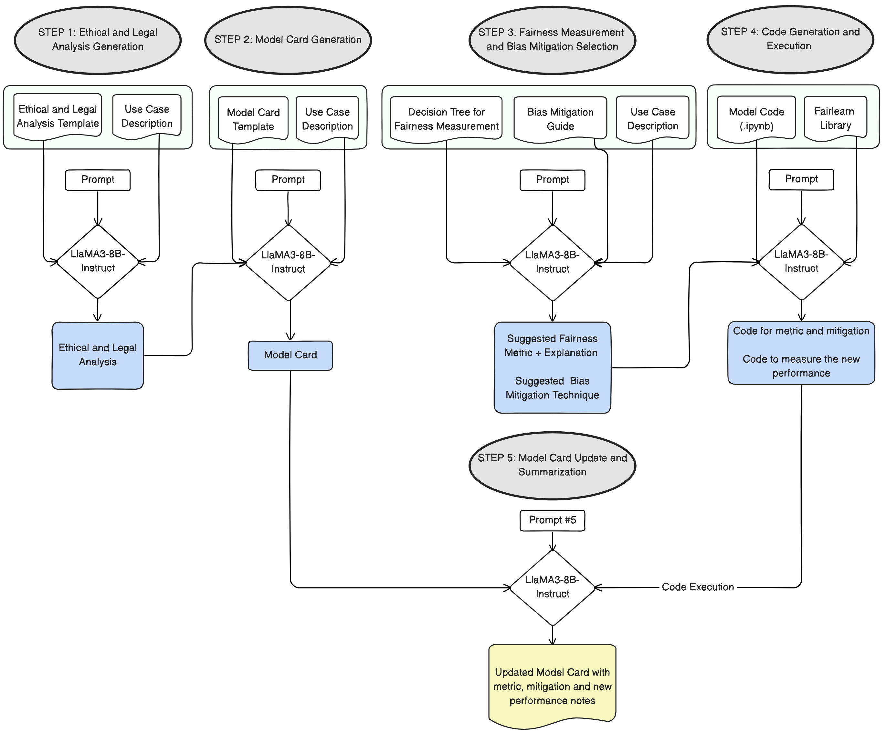

# Automated Responsible AI Evaluation

This project presents an automated, Large Language Model (LLM)-driven pipeline for responsible AI evaluation, designed to bridge the gap between high-level ethical principles and practical implementation in AI systems, with a focus on ensuring fairness.

## Key Features

1. Utilizes LLMs to generate ethical analyses, model cards, and code
2. Implements fairness metrics and bias mitigation techniques from the [Fairlearn library](https://fairlearn.org/v0.10/api_reference/index.html)
3. Provides a structured approach to evaluating and improving AI model fairness
4. Generates transparent and reproducible reports

## Installation and Prerequisites

To set up the project:

1. Clone the repository:

   ```
   git clone https://github.com/axa-rev-research/automated-responsible-ai-evaluation.git
   cd automated-responsible-ai-evaluation
   ```
2. Install the required Python libraries:

   ```
   pip install -r requirements.txt
   ```

Prerequisites:

- OpenAI API key
- Hugging Face account with access to Llama3-8B-Instruct
- At least 16 GB of GPU memory to run Llama3-8B-Instruct (quantized to 8-bit)
- Python 3.8 or higher

The `requirements.txt` file includes all necessary libraries: transformers, bitsandbytes, torch (PyTorch), fairlearn, and openai.

Note: Ensure your OpenAI API key and Hugging Face credentials are properly set up before running the project.

## Overview

The pipeline assists AI project stakeholders in implementing responsible AI practices by:

1. Conducting ethical and legal analyses of AI systems
2. Generating comprehensive model cards
3. Selecting appropriate fairness metrics and bias mitigation methods
4. Generating and executing code for fairness measurement and bias mitigation
5. Updating model cards with fairness interventions



## Project Structure

The repository is organized as follows, detailed hierarchy can be found in the respective folders' README files:

- `Steps-v3-thesis/`: Main pipeline directory
  - `files/`: Directory containing cases (data, model and description), output templates and `fairlearn` library codes
  - `step1-ethics-analysis-gen.ipynb`: Notebook for generating ethical and legal analysis
  - `step2-model-card-gen.ipynb`: Notebook for generating model card
  - `step3-fairness-analysis-gen.ipynb`: Notebook for fairness measurement and bias mitigation method selection
  - `step4-fairness-code-gen.ipynb`: Notebook for generating fairness-related code
  - `step5-updated-model-card-gen.ipynb`: Notebook for generating updated model card with fairness interventions
- `Steps-v3-gpt/`: Includes a separate pipeline implementation with GPT-4 and GPT-4o to generate the ground truth documents and evaluating the outputs of the main pipeline.
  - `files/`: Directory containing cases (data, model and description), ground truth and evaluation results
  - `evaluator.ipynb`: Assesses the quality and accuracy of generated analysis by comparing it to ground truth data. It summarizes and compares both the generated and ground truth texts, then calculates precision, recall, and F1 score to quantify the main pipeline's performance.
  - `step1-ethics-analysis-gen.ipynb`: Notebook for generating ground truth ethical and legal analysis
  - `step2-model-card-gen.ipynb`: Notebook for generating ground truth model card
  - `step3-fairness-analysis-gen.ipynb`: Notebook for ground truth fairness measurement and bias mitigation method selection
  - `step4-fairness-code-gen.ipynb`: Notebook for generating fairness-related code
  - `step5-updated-model-card-gen.ipynb`: Notebook for generating ground truth updated model card with fairness interventions

## Usage of the Pipeline

Each case has its own folder under `Steps-v3-thesis/files/cases`, containing the relevant files for that specific case.

### Commonly Used Helper Functions:

* `save_result`: Saves the generated analysis to a file in the specified path.
* `setup_environment`: Sets up the environment variables, including the Hugging Face API key.
* `load_model`: Loads the LLM model and tokenizer using the provided API key.
* `generate_response`: Generates a response from the LLM model based on the provided messages and configuration.

### Step 0: Create a Model and Use Case Description

- Purpose: Generate a description of the model and use case using the provided template.
- Template: `Steps-v3-thesis/files/templates/description-template.md`
- Output: `description.md` file in the respective case folder under `files/cases`.

### Step 1: Ethical and Legal Analysis Generation

- Purpose: Conduct an ethical and legal analysis of the AI system based on the case description.
- Input: `description.md` file from the respective case folder.
- Output: `ethics-analysis.md` file saved in the respective case folder.

### Step 2: Model Card Generation

- Purpose: Create a comprehensive model card that summarizes the AI system's details and ethical considerations.
- Inputs:
  - `description.md` file from the respective case folder.
  - `ethics-analysis.md` file from the respective case folder.
- Output: `model-card.md` file saved in the respective case folder.

### Step 3: Fairness Measurement and Bias Mitigation Selection

- Purpose: Select appropriate fairness metrics and bias mitigation methods based on the case description and fairness analysis.
- Inputs:
  - `description.md` file from the respective case folder.
  - `decision_tree.json` file from the `files/fairness-tools` directory.
  - `mitigation.md` file from the `files/fairness-tools` directory.
- Output: `fairness-analysis.md` file saved in the respective case folder.
- Helper Functions:
  - `load_questions_from_file`: Loads questions from a JSON file containing the decision tree.
  - `extract_yes_no`: Extracts a 'YES' or 'NO' answer from the LLM's response.

### Step 4: Code Generation and Execution

- Purpose: Generate and execute Python code for measuring fairness metrics and implementing bias mitigation methods.
- Inputs:
  - Fairness metric and bias mitigation method selected in Step 3.
  - `fairlearn-lib.md` file from the `files/fairness-tools` directory.
  - Model code from the respective case folder under `files/model-generator`.
- Output: Execution results saved in a text file (e.g., `demo.txt`) in the `files/logs` directory.
- Helper Functions:
  - `add_to_log`: Appends text to a log file.
  - `extract_python_code`: Extracts Python code from a given text.
  - `extract_section`: Extracts a specific section from a file based on the provided title.
  - `open_notebook`: Opens a Jupyter notebook and extracts the code cells as a single script.
  - `add_code_cell_to_notebook`: Adds a new code cell containing the generated code to an existing Jupyter notebook.
  - `execute_notebook`: Executes a Jupyter notebook and returns the output of the last cell or the last two cells.

### Step 5: Model Card Update and Summarization

- Purpose: Update the model card generated in Step 2 to include fairness interventions and summarize the pipeline results.
- Inputs:
  - `model-card.md` file from the respective case folder.
  - `fairness-analysis.md` file from the respective case folder.
  - Execution results text file from the `files/logs` directory.
- Output: Updated model card (e.g., `demo-model-card-updated.md`) saved in the `files/model-cards-final` directory.
